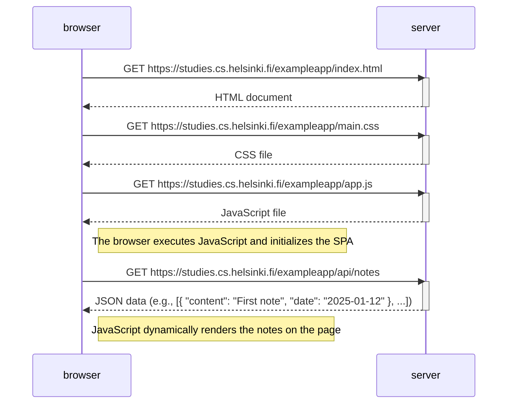

- **Note**: This is the same as traditional web pages

```mermaid  
sequenceDiagram
    participant browser
    participant server

    browser->>server: GET https://studies.cs.helsinki.fi/exampleapp/index.html
    activate server
    server-->>browser: HTML document
    deactivate server

    browser->>server: GET https://studies.cs.helsinki.fi/exampleapp/main.css
    activate server
    server-->>browser: CSS file
    deactivate server

    browser->>server: GET https://studies.cs.helsinki.fi/exampleapp/app.js
    activate server
    server-->>browser: JavaScript file
    deactivate server

    Note right of browser: The browser executes JavaScript and initializes the SPA

    browser->>server: GET https://studies.cs.helsinki.fi/exampleapp/api/notes
    activate server
    server-->>browser: JSON data (e.g., [{ "content": "First note", "date": "2025-01-12" }, ...])
    deactivate server

    Note right of browser: JavaScript dynamically renders the notes on the page


```