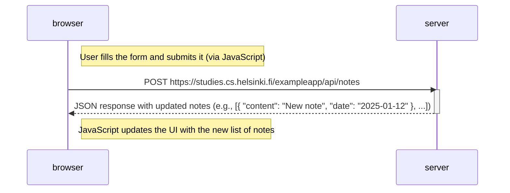

```mermaid  
sequenceDiagram
    participant browser
    participant server

    Note right of browser: User fills the form and submits it (via JavaScript)

    browser->>server: POST https://studies.cs.helsinki.fi/exampleapp/api/notes
    activate server
    server-->>browser: JSON response with updated notes (e.g., [{ "content": "New note", "date": "2025-01-12" }, ...])
    deactivate server

    Note right of browser: JavaScript updates the UI with the new list of notes

```